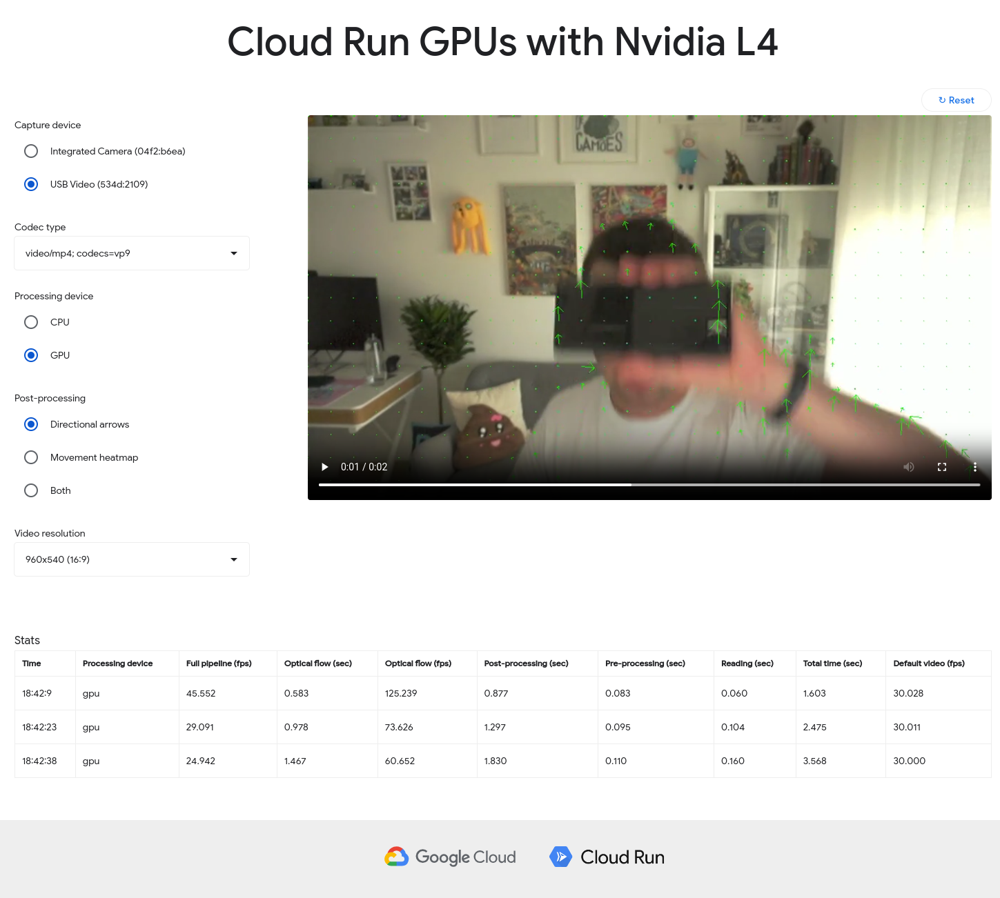

# crGPU - OpenCV CUDA accelerated demo on Google Cloud Run with GPU support

**crGPU** is simple demo that leverages GPUs on Cloud Run to accelerate OpenCV workloads with CUDA.

## Features

* This sample demo uses Farneback algorithm for estimating optical flow. It supports both CPU and GPU (CUDA based) implementations from OpenCV.

## Getting Started

### Prerequisites

* Python 3.x
* Docker
* Terraform
* Google Cloud Storage bucket

### Local Setup

1. Clone this repository: `git clone git@github.com:NucleusEngineering/cloudrun-gpu-opencv-demo.git`
2. Build the container with `docker build -t crgpu:latest`
3. Start the Docker containers: `docker run -p 8080:8080 bash crgpu:latest`
4. Access the application at: http://localhost:8080   

### Deploying directly to Cloud Run

1. Build the image via `docker build -t {GCP_REGION}-docker.pkg.dev/{YOUR_PROJECT_ID}/{YOUR_ARTIFACT_REGISTRY_NAME}/crgpu:latest`
2. Push the via `docker push {GCP_REGION}-docker.pkg.dev/{YOUR_PROJECT_ID}/{YOUR_ARTIFACT_REGISTRY_NAME}/crgpu:latest`
3. Deploy via
<pre><code>
gcloud alpha run deploy {YOUR_SERVICE_NAME}
        --project {YOUR_PROJECT_ID}
        --image  {GCP_REGION}-docker.pkg.dev/{YOUR_PROJECT_ID}/{YOUR_ARTIFACT_REGISTRY_NAME}/crgpu:latest
        --cpu  {CPU_QTY}
        --memory  {MEMORY}
        --gpu  {GPU_QTY}
        --no-cpu-throttling
        --gpu-type  {GPU}
        --max-instances  {MAX_INSTANCES}
        --region  {GCP_REGION}
        --execution-environment gen2
        --allow-unauthenticated
</code></pre>
4. (optional) Set GCP bucket as the storage backend via
<pre><code>
gcloud beta run services update {YOUR_SERVICE_NAME}
        --project {YOUR_PROJECT_ID}
        --region  {GCP_REGION}
        --add-volume name=videos,type=cloud-storage,bucket=${YOUR_GCP_BUCKET_NAME}
        --add-volume-mount volume=videos,mount-path=/app/videos
</code></pre>

### Deploying with Cloud Build / Cloud Deploy

1. Create a GCS bucket (ideally in the same region where you will deploy this demo)
2. In the root project folder, execute Cloud Build: `gcloud builds submit --config cloudbuild.yaml --substitutions _SERVICE_NAME=your-service-name,_REGION=your-gcp-region,_BUCKET=your-gcs-bucket-name`
3. Get the URL where the demo was deployed: `gcloud run services list | grep -i crgpu`
4. Check the available substitutions inside cloudbuild.yaml for more tailored configuration (`_CPU_QTY: '8'`,  `_GPU_QTY: '1'`, `_MAX_INSTANCES: '3'`, `_MEMORY: 32Gi`, `_GPU: nvidia-l4`)

## Usage

Open the local or deployed url and select whether you want the video to be processed on the CPU or the GPU. Also select the post-processing effect and the resolution. Compare the stats for multiple resolutions to observe what improvments in performance GPUs bring.

## Disclaimer

> :warning: Warning This demo in its default state uses relatively expensive GPU resources. Running this demo for an extended amount of time may incur significant costs.

## License

Apache License 2.0. See the [LICENSE](LICENSE) file.

This is not an officially supported Google product
